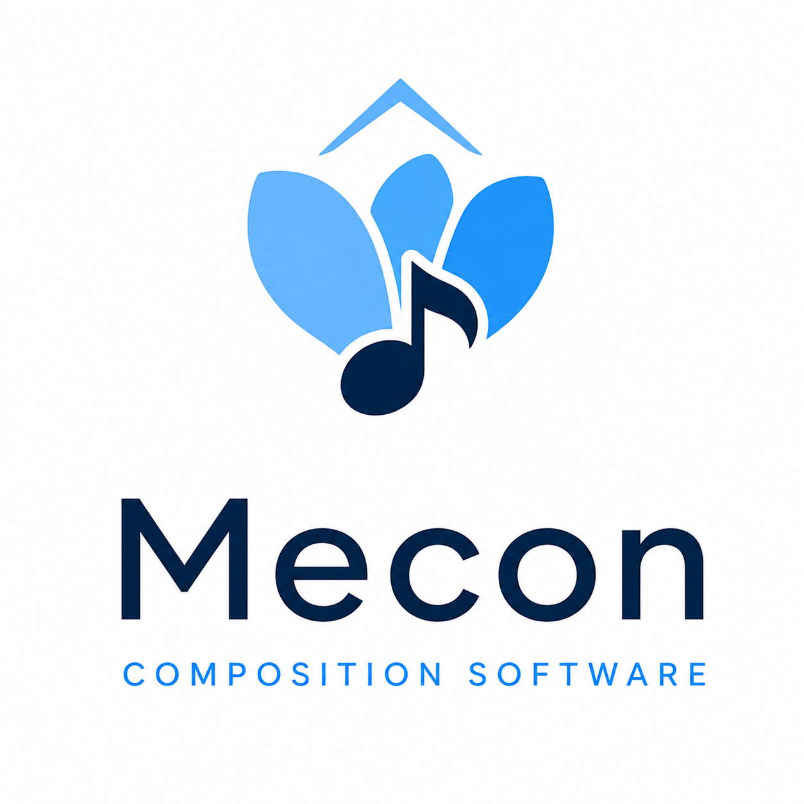

# Mecon

<p align="center">
  
</p>

项目主页：[https://mecon-score.link/](https://mecon-score.link/)

**为热爱音乐、但不需要精通乐理或编程的人打造的打谱与创作工具。**

打谱、乐理学习、作曲、灵感记录，一个软件搞定。

## 这是什么

弹了很多年琴，却总是看不懂和声进行是怎么回事？脑子里有一段旋律，却对着五线谱软件无从下手？

Mecon 想做的，是把"专业级的记谱与和声分析能力"装进一个音乐爱好者也能上手的软件里：

- 不用先学会用五线谱软件——用电脑键盘或 MIDI 键盘弹奏，就能实时记谱；
- 不用先修完和声学——软件能"听懂"你写的和弦进行，指出问题所在，并给出规范写法作对照；
- 不用从零开始——已有的乐谱可以直接导入，未来还能直接拍照识别导入。

## 核心亮点

### 打谱：跟着弹就能记谱

- 电脑键盘或 MIDI 键盘均可实时录入音符、和弦、休止与连音，支持"绝对音高"与"调内相对音高"两种录入习惯，怎么顺手怎么来。
- 鼠标点选式音符笔和乐谱元素面板，五线谱所见即所得。
- 支持较为完整的记谱需求：反复记号、连音、力度与速度记号、多谱表配器等。
- 内置播放，随时听一听刚写的东西对不对；撤销/重做让你放心尝试。

### 乐理学习：像做习题一样学和声

- 内置传统四部和声写作规则引擎：给定一串和弦进行，软件能生成符合教材规范的四声部写法，也能指出你写的地方违反了哪条规则，并给出对照的正误示例。
- "探索模式"让你像做习题一样提问、运行、听结果、看讲解，逐步建立乐理直觉——四部和声、属七和弦、勋伯格和声学综合练习等章节已经可以试用。

### 作曲与灵感：从一条旋律到整份总谱

- 分层的分析视角把总谱、缩谱、和声骨架层层打通，方便先写好一条主旋律的骨架，再逐步配器展开成完整总谱。
- 面向未来的"即兴模块"：你只做音乐走向的高层选择，软件实时生成合规又好听的候选实现，作为一件实时创作的乐器。

### 与外部世界互通

- 支持 MusicXML 双向导入导出，方便与其他记谱软件、乐谱资源库互通。
- 图片 / PDF 乐谱识别（拍照记谱）正在设计中，未来可以把纸质谱直接扫描导入。

## 项目进展

Mecon 正在积极开发中：打谱与部分乐理学习功能已经可以试用，其余亮点仍在完善或设计阶段。完整的功能状态、里程碑与开发排期见 [docs/roadmap.md](docs/roadmap.md)，完整文档索引见 [docs/README.md](docs/README.md)。

## 快速开始

想现在就试用，需要先准备好 JDK 17+ 与 Gradle（暂未提供打包好的安装程序）：

```bash
git clone <本仓库地址>
cd music-theory-frontend
./gradlew :apps:desktop:run       # Windows 用户: .\gradlew.bat :apps:desktop:run
```

完整的构建、测试与依赖仓库配置说明见 [docs/development.md](docs/development.md)。

## 了解更多

- [docs/README.md](docs/README.md) — 完整文档索引（架构、数据模型、渲染引擎、乐理库、UI 等）
- [docs/roadmap.md](docs/roadmap.md) — 开发进度与路线图
- [docs/development.md](docs/development.md) — 构建、测试与依赖仓库配置
- [CONTRIBUTING.md](CONTRIBUTING.md) — 分支、Commit、PR 与 AI 辅助披露规范
- [CHANGELOG.md](CHANGELOG.md) — 发布变更记录
- [AGENTS.md](AGENTS.md) — 仓库开发与架构约束
- [SECURITY.md](SECURITY.md) — 安全问题报告

## 许可证

Mecon 以 [GNU GPLv3 或更高版本](LICENSE) 发布。第三方依赖和素材仍以各自许可证为准。
